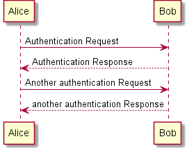

jekyll-liquid-plantuml-plugin
==========================

Installation
============

Just copy the `liquid_plantuml.rb` file to your `_plugins` folder.

Requirements
============

Obviously you must have a plantuml installation([plantuml](http://plantuml.sourceforge.net/))

Configuration
=============

There are several configuration parameters that you can define in your `_config.yml`. Here is a sample of such items:

    # ...
    # ... your _config.yml file ...
    # ...

    # plantuml plugin
    liquid_plantuml:
      debug: false
      center: true
      output_directory: /assets/uml
      uml_cmd: "java -jar ~/Tools/plantuml.jar -charset utf-8 $umlfile -o $output_directory" 

An explanation of those parameters follows:

*   `debug` (boolean): Activates the debug mode with which you can see the compilation commands that are executed during build. Default value: `false`
*   `center` (boolean): Center the final image or not. Default value: `true`
*   `output_directory` (web path): Path in which the generated PNG will be placed. Default value: `/assets/uml`
*   `uml_cmd` (string): Command line to execute for the `.txt` to `.png` conversion. Default value: `java -jar ~/Tools/plantuml.jar -charset utf-8 $umlfile -o $output_directory`

In these `uml_cmd` parameters you can use the following variables:

*   `$umlfile`: Name of the UML input text file
*   `$output_directory`: Name of the output directory

Usage
=====


    
    ...
    


Sample usage
============

You can type the following block of plantuml inside one of your posts:

    
	Alice -> Bob: Authentication Request
	Bob --> Alice: Authentication Response
	Alice -> Bob: Another authentication Request
	Alice <-- Bob: another authentication Response	
    

And you will get it rendered like this:

Notes
=====

*   The plugin doesn't recompile a previously rendered block of plantuml. It takes into consideration a change in the text or a change in the arguments. This reduces the total time of the building process.

    Aside, you can delete all the contents of your Plantuml generated blocks in the source directory if you want to make a backup copy of your site. It will be completelly regenerated when you rebuild your site.

*   Also, this plugin keeps the folder of generated images in a clean state. That is, there will be only those images that are used in your site. All previously generated images will be deleted if they are detected as orphaned from the posts.
